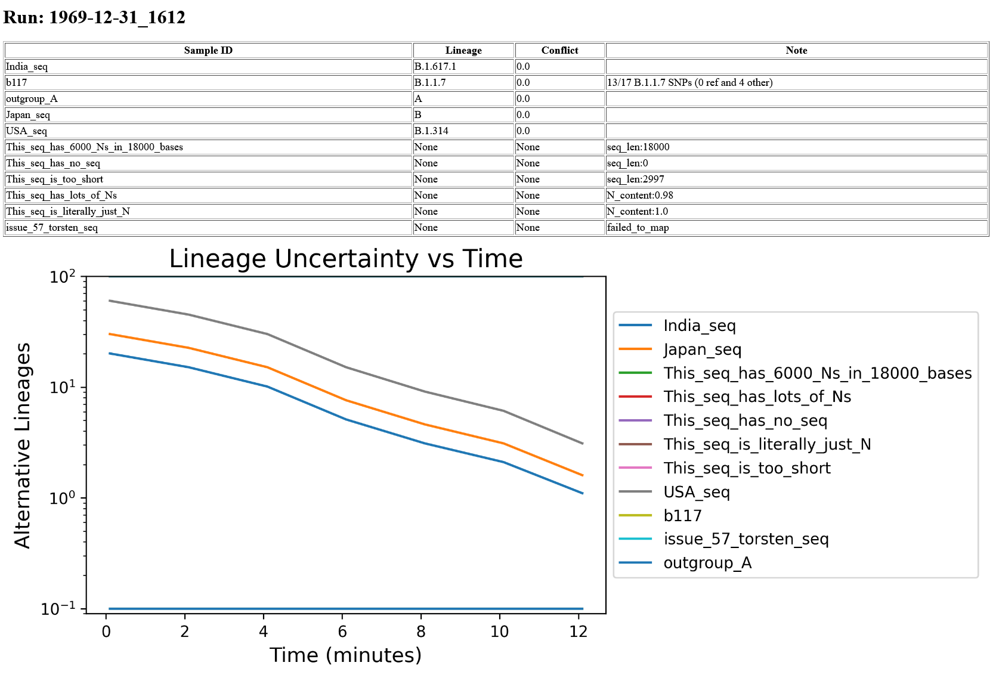

# MinION-Pangolin-Pipeline

## Objective
Build a platform that performs real time Pangolin lineage identification with a MinION to help operators determine when to end a run while improving sequencing throughput and flow cell efficiency.

## Pipeline, High Level
* Start MinION run  
* Sequencing files on server updated every 5-10 minutes 
    * Assemble genome with Artic 
    * Run through PangoLEARN classifier    
* Report lineage and confidence over time on web interface

## Implementation Details
**MinION**
1. New files from starting a MinION run starts a cron job that syncs file changes to the server every 5 minutes.
2. File syncing stops when there are no changed files after 10 minutes

**Server**:
1. When a new run is started, files are synced to the server. A watchdog observing the sync directory maintains a webserver and starts the data processing pipeline in newly created directories. 
2. The main data processing pipeline updates the Pangolin Covid19 lineage classifier, builds all Docker images and begins periodic processing.
2. The [Artic pipeline](https://artic.network/ncov-2019/ncov2019-bioinformatics-sop.html) Docker container starts first and operates of barcode directories containing 5 or more FASTQ files:
	* Filters barcode reads with Artic guppyplex
	* Generates MinION specific consensus sequences from barcodes
	* Aggregates consensus sequences into one file
	* Disposes of intermediate files
3. Upon completing consensus aggregation, start [Pagolin pipeline](https://cov-lineages.org/pangolin_docs/usage.html) Docker container:
	* Input consensus sequence FASTA
	* Generates an output CSV detailing probable lineage and uncertainty
4. With the Pangolin output CSV, the webserver updater Docker container:
	* Parses the CSV to extract relevant data
	* Appends data to a separate CSV capturing the time series data
	* Generates a figure depicting lineage uncertainty over time
	* Updates the HTML file for the run with new data and figure
	* Creates a link to the run HTML file if the run file was just created
5. Script terminates when no file changes are made after 10 minutes

The webserver is hosted by an Nginx Docker container and shares HTML files with the webserver updater Docker container. If the watchdog is terminated, the webserver terminates.

A fake run page with psuedo data is provided below:

## Requirements
* Docker
* Bash
